# CriminalIntent
----------------
An Android app to record criminal behaviors in public area, supporting phones and tablets.
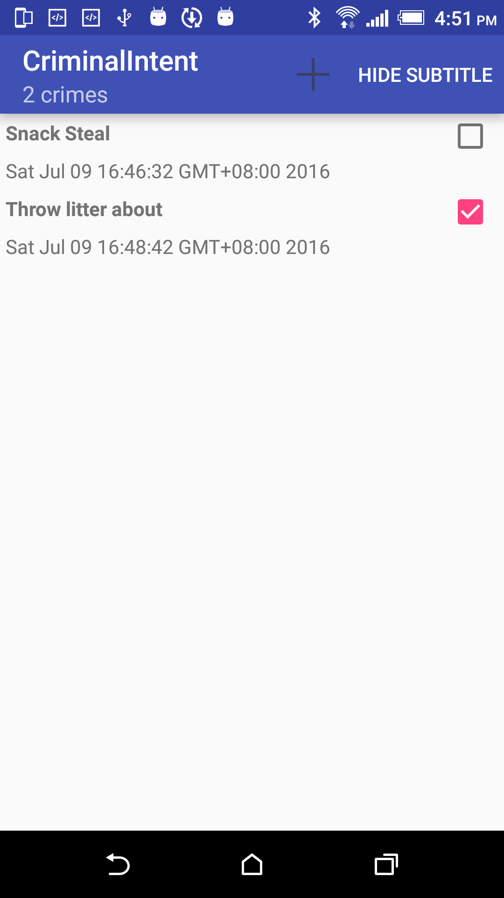
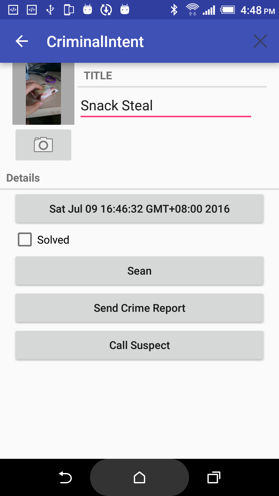
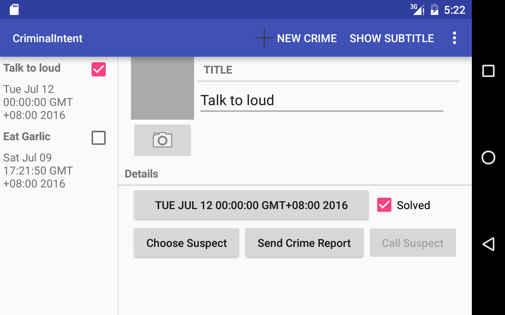

## Features
* Easy to edit the crime, choose the date and suspect.

	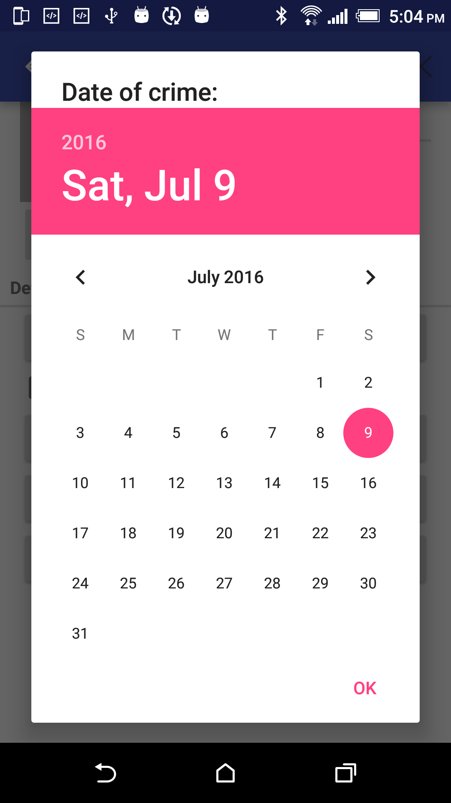
	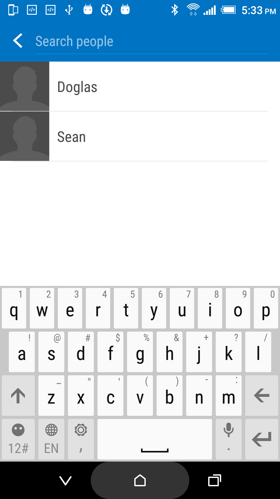
	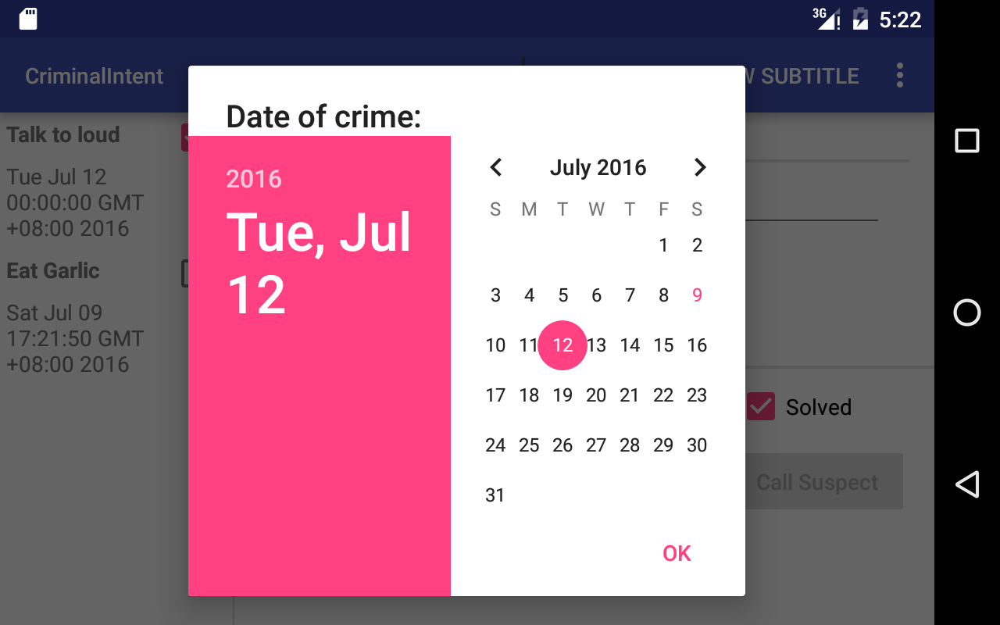

* Easy to send text message and call the suspect.

	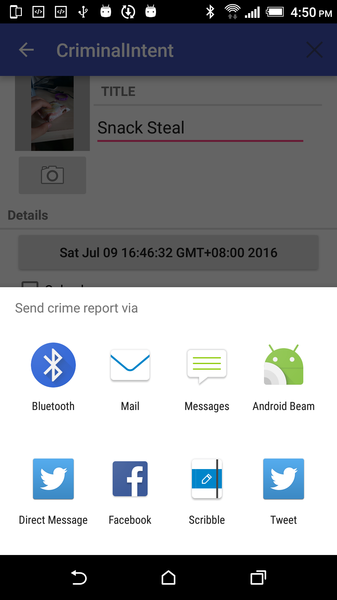
	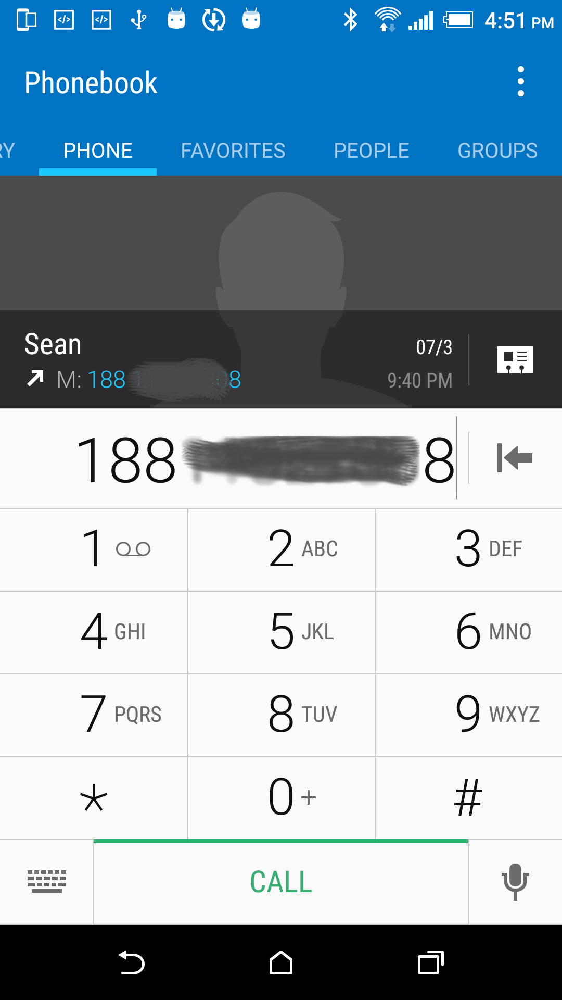

	
* Convenient to review all the crimes.

	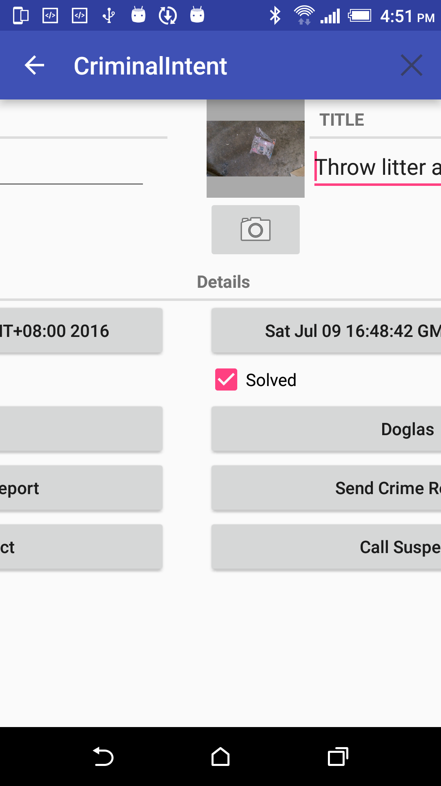

* Convenient to view the detailed picture of the crime.

	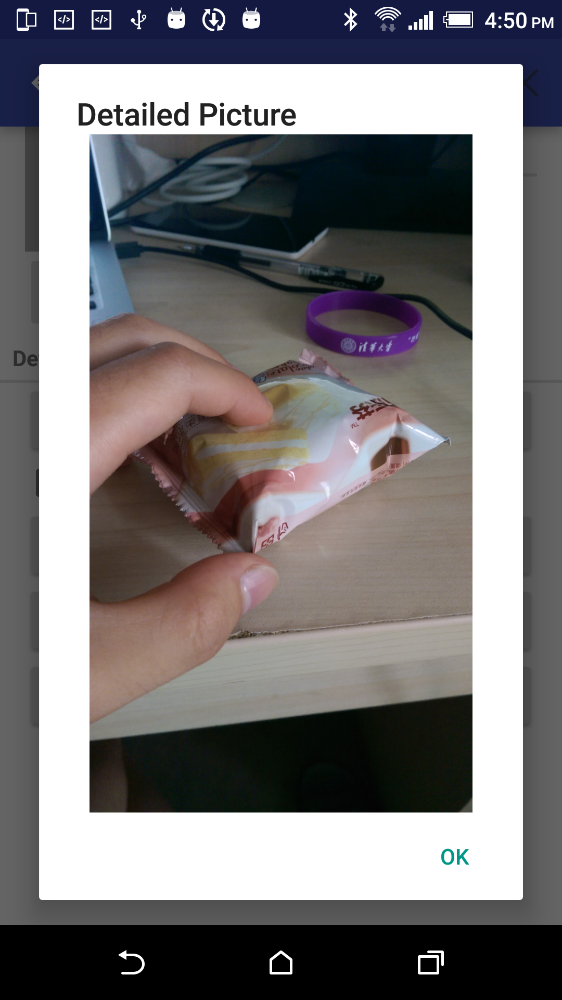
	
* Show the total number of crimes.

	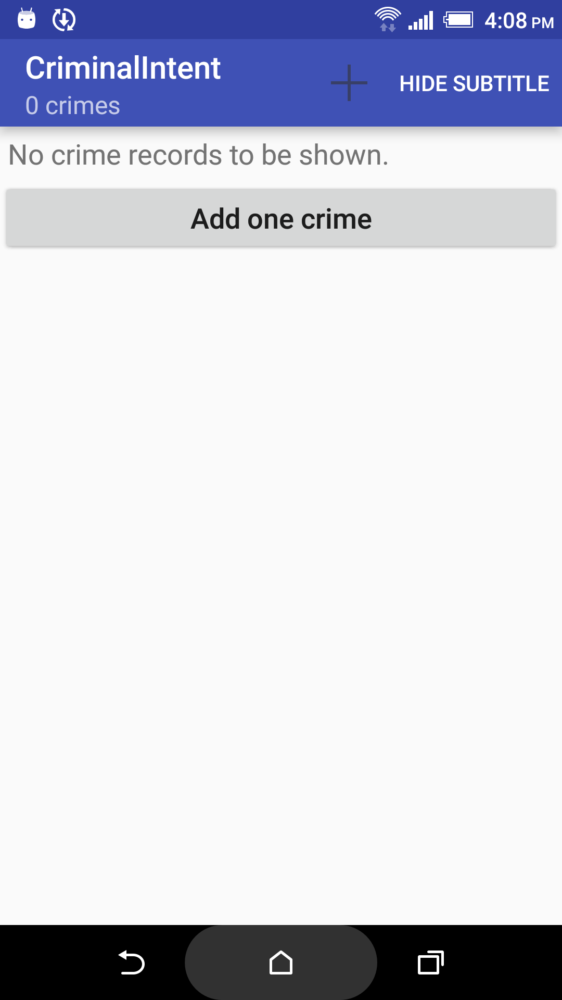
	

---------------------------------
This is my version of the second app of the book *Android Programming - The Big Nerd Ranch Guide, Second Edition*, and I have finished all the challenges in each chapter and add some new features.